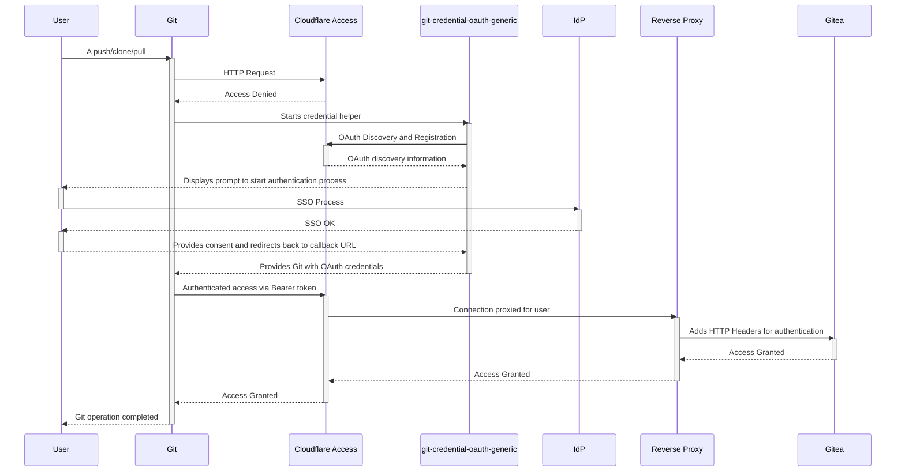

# git-credential-oauth-generic

A Git credential helper that authenticates to any OAuth-protected Git host using
standard RFCs, with no hardcoded provider knowledge:

- **RFC 9728** - Protected Resource Metadata (discovery)
- **RFC 8414** - OAuth Authorization Server Metadata
- **RFC 7591** - Dynamic Client Registration
- **RFC 8707** - Resource Indicators (PKCE authorization code flow)

Originally developed for use with Cloudflare Access
[Managed OAuth](https://blog.cloudflare.com/managed-oauth-for-access/),
but should work with any authorization server implementing the above RFCs.

## Example Flow with Cloudflare Access



## Requirements

- **Git 2.45 or later** - this helper uses the `authtype` Bearer token credential
  format introduced in Git 2.45. Older versions of Git cannot send Bearer tokens
  and will not work with this helper. The helper will exit with an error if the
  running Git version does not support this capability.

  On Ubuntu 24.04 LTS, the system Git may be older than 2.45. Upgrade via the
  official Git maintainers PPA:

  ```sh
  sudo add-apt-repository ppa:git-core/ppa
  sudo apt update
  sudo apt upgrade git
  ```

## How it works

1. Git invokes the helper with `protocol=https` and `host=<host>` on stdin
2. The helper fetches `https://<host>/.well-known/oauth-protected-resource` (RFC 9728)
   to discover the authorization server
3. The AS metadata is fetched (RFC 8414) to obtain endpoints and supported scopes
4. If no `client_id` is cached in Git config, the helper registers dynamically
   (RFC 7591) and stores the resulting `client_id` in Git config; the `client_secret`
   returned by the server is stored securely in the OS keyring
5. A PKCE authorization code flow is performed with a `resource` parameter (RFC 8707),
   opening the system browser and listening for the callback on localhost
6. The resulting Bearer token is returned to Git via the `authtype=Bearer` credential
   format

Token storage and refresh are save to the OS keyring by default or by a chained Git
credential storage helper (e.g. `git-credential-cache`).

## Installation

```sh
go install github.com/andrewheberle/git-credential-oauth-generic@latest
```

## Configuration

Configure the credential helper:

```sh
# Linux
git config --global --add credential.helper oauth-generic

# macOS (untested)
git config --global --add credential.helper oauth-generic

# Windows
# The Git Credential Manager (GCM) is enabled at a system level by default and must
# be disabled (see below for further information)
git config --global --add credential.helper ""
git config --global --add credential.helper oauth-generic
```

Configure as a chained credential helper (storage helper first, this helper second):

```sh
# Linux
git config --global --add credential.helper "cache --timeout 21600"
git config --global --add credential.helper "oauth-generic --nopersist"

# macOS (untested)
git config --global --add credential.helper osxkeychain
git config --global --add credential.helper "oauth-generic --nopersist"
```

On Windows the `wincred` and `manager` (GCM) helpers do not correctly store the
credentials output by `oauth-generic` based on testing so far.

### Callback port

The default callback port is `8400`, matching Cloudflare Access's expected
redirect URI pattern. To use a different port:

```sh
git config --global --add credential.helper "oauth-generic --port 9000"
```

## Credential storage

The dynamically registered `client_id` is stored in Git config:

```
credential.https://git.example.com.oauthClientId
```

The `client_secret` is stored securely in the OS keyring (DBUS Secret Service on
Linux, Keychain on macOS, Windows Credential Manager on Windows) under the service
name `git-credential-oauth-generic` with the resource URL as the account name.

Access tokens and refresh tokens are also stored in the OS keyring by default
but may be optionally stored by the chained storage helper by adding the
`--nopersist` option and are never written to disk by this helper directly.

## Verbose mode

```sh
git config --global --add credential.helper "oauth-generic --verbose"
```

Or test directly:

```sh
printf 'protocol=https\nhost=git.example.com\n' | git-credential-oauth-generic --verbose get
```

## Notes for Windows users

As noted above, on a default install of Git on Windows the Git Credential Manager
will not correctly store the returned credentials for subsequent git actions
(tested as of Git 2.54.0 with Git Credential Manager 2.7.3) so the options are:

1. Globally disable Git Credential Manager (as shown above)
2. Leave Git Credential Manager enabled but follow the below process to have only `oauth-generic` enabled:
   ```sh
   # Enable the generic OAuth credential manager
   git config --global --add credential.helper oauth-generic

   # Clone/pull to initially authenticate (cancel the GCM login prompt that appears)
   git clone https://git.example.com/user/test-repo.git

   # In your local repo disable all other credential helpers and enable oauth-generic
   cd test-repo
   git config --local --add credential.helper ""
   git config --local --add credential.helper oauth-generic
   ```
