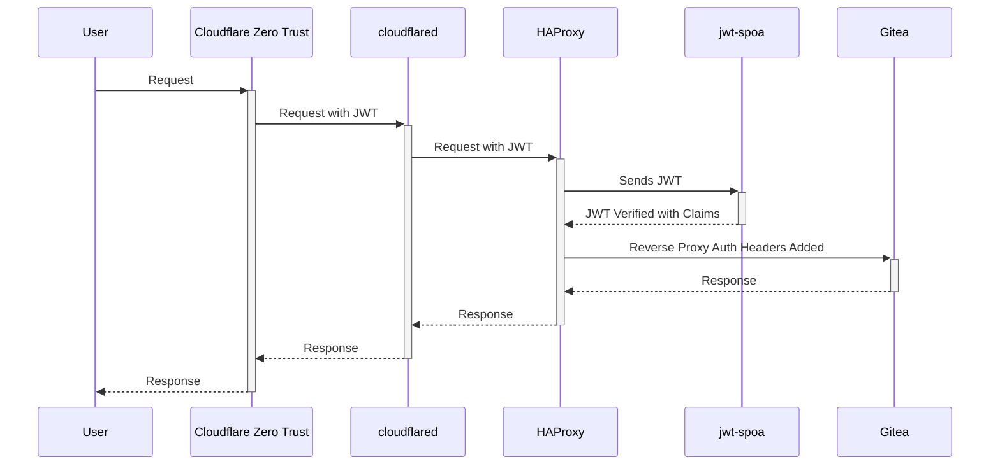

# Example Use

This is a minimal example of using this credential helper to authenticate
against a Gitea instance that is protected by Cloudflare Access.

This example uses HAProxy with a SPOA
([jwt-spoa](https://github.com/andrewheberle/jwt-spoa)) to validate the JWT
from Cloudflare Access to allow HAProxy to set the required HTTP headers for
Gitea [reverse proxy authentication](https://docs.gitea.com/administration/authentication#reverse-proxy).



## Prerequisites

1. Docker
2. The following Cloudflare resources are required:
   * DNS zone on Cloudflare (yourdomain.com)
   * A configured Cloudflare Zero Trust application for Gitea with Managed
     OAuth enabled (gitea.yourdomain.com)
   * A Cloudflare tunnel token (for providing access)
3. Create the required folder structure:
   ```sh
   mkdir -p /path/to/compose/file/{config,data}
   ```
4. Configure required secrets/envrionment variables:

   Add the following to the `.env` file in the same directory as the compose file.

   ```sh
   JWT_AUD=audience-of-gitea-zero-trust-application
   JWKS_URL=https://yourteamdomain.cloudflareaccess.com/cdn-cgi/access/certs
   JWT_ISS=https://yourteamdomain.cloudflareaccess.com
   CLOUDFLARED_TOKEN=token-from-cloudflare-tunnel-setup
   ```

## Start Gitea

```sh
cd /path/to/compose/file/
docker compose up -d
```

At this point you should visit https://gitea.yourdomain.com to ensure Gitea is
configured properly and create a test respository to clone or push to.

## Set Up The Credential Helper

```sh
git config --global --add credential.helper oauth-generic
```

### Clone A Repository from Gitea

```sh
git clone https://gitea.yourdomain.com/username/repo.git
```

When you attempt to authenticate against the repository a browser should be
opened that will take you through the authentication process.
